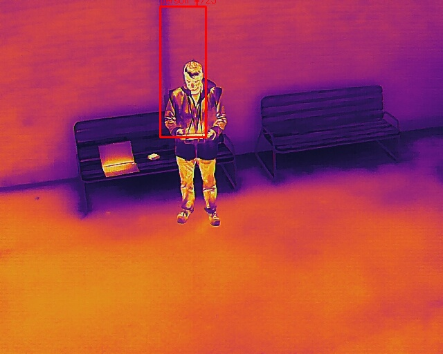
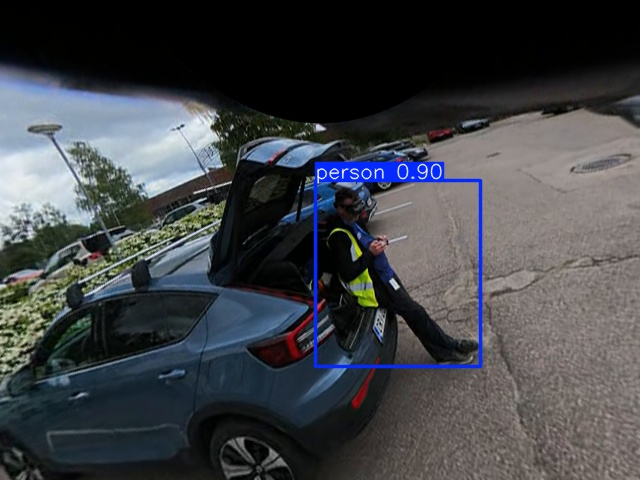
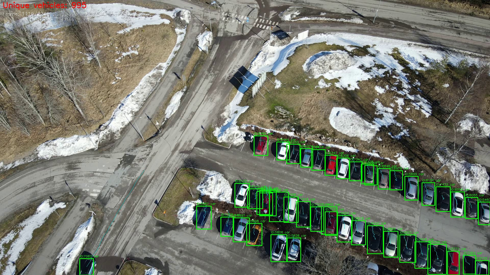
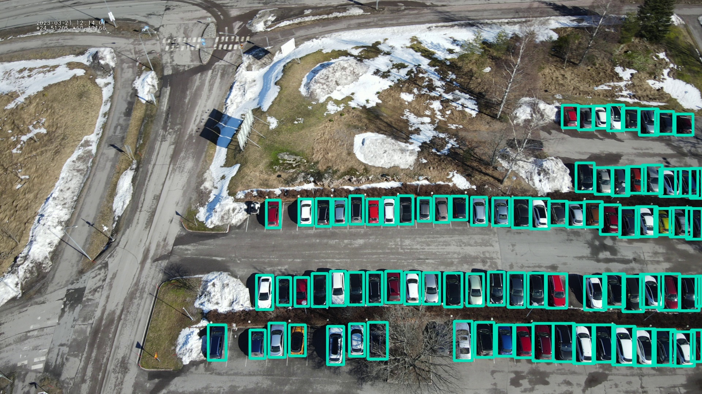
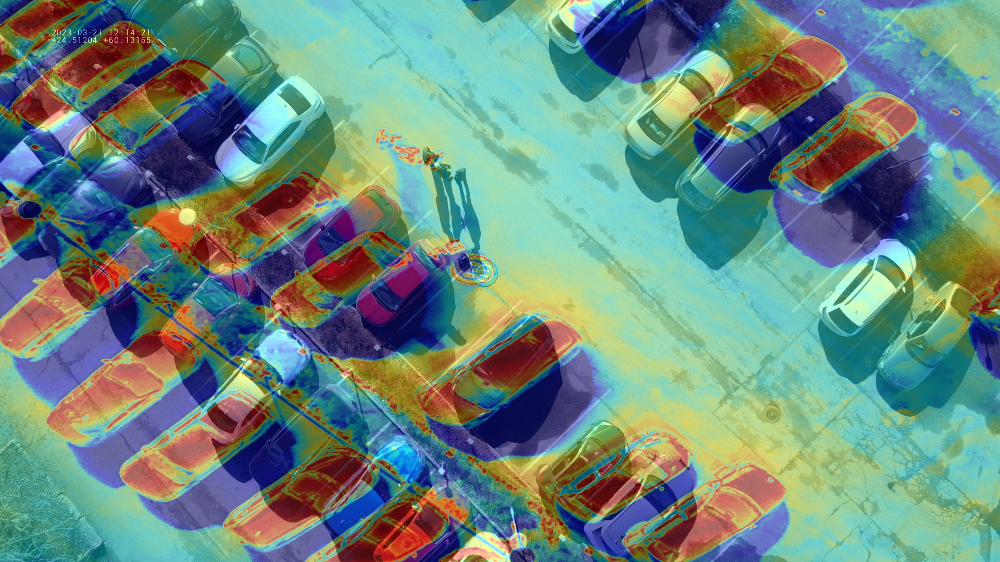
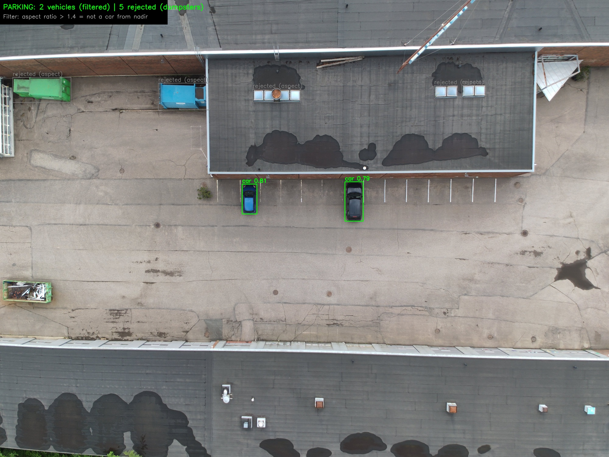
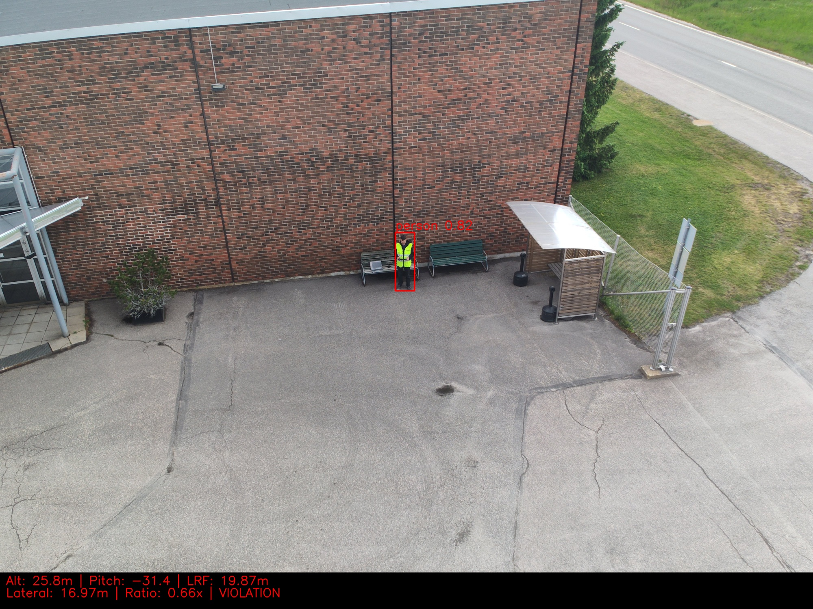
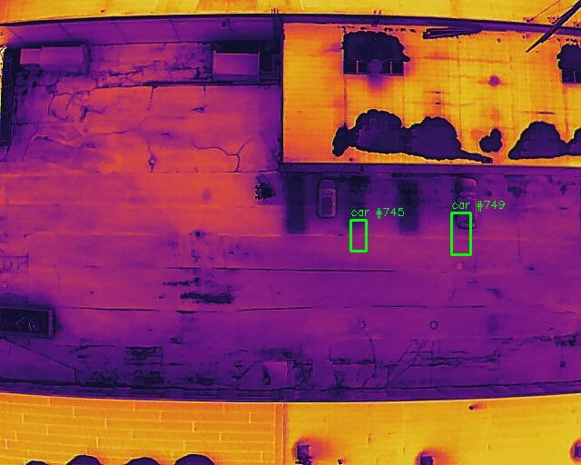
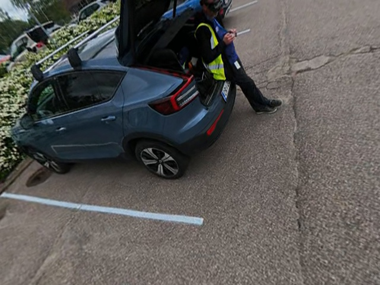

# Drone CV — Detection & Parking Monitor

[](CHANGELOG.md)
[](https://rwiren.github.io/drone-cv-detection/)
[](#)
[](#)
[](#)
[](#)
[](#)
[](CHANGELOG.md)
[](CONTRIBUTING.md)


| Autel — 95 cars at 80m (4K) | Autel — thermal person (18.8m) | Avata 360 — person 0.90 (dual-fisheye) |
|---|---|---|
|  |  |  |

Multi-platform aerial computer vision research with **two core use cases** validated across three drone platforms:

1. **Person Detection & 1:1 Safety Rule** — detect persons, calculate lateral distance, enforce EU 1:1 rule
2. **Parking Occupancy Monitoring** — count vehicles, identify free slots, thermal fusion

| Use Case | DJI M2EA | Autel MAX 4T V2 xe | DJI Avata 360 |
|----------|----------|-------------------|---------------|
| **1:1 Person Detection** | GSD formula + SRT | LRF ground truth + MQTT | 360° dual-fisheye + ensemble |
| **Parking Occupancy** | VisDrone + ByteTrack | VisDrone + SAHI + onboard AI | Nadir perspective crops |

## Safety Distance System — EU 1:1 Rule


The system detects persons from a UAV, calculates lateral distance using monocular camera geometry, compares it against `determined_value × altitude`, and can issue alerts when the EU 1:1 rule is violated.

**Implemented and tested on three platforms:**

| Capability | DJI M2EA | Autel MAX 4T V2 xe | DJI Avata 360 |
|---|---|---|---|
| Object detection (YOLO) | VisDrone YOLOv8s on RGB | VisDrone + COCO + onboard AI | Dual-fisheye → v8m + COCO ensemble |
| Lateral distance calculation | GSD + ray-cast from SRT | LRF direct measurement | GSD from perspective crop + SRT |
| Gimbal pitch from metadata | DJI SRT `Pitch:` field | MQTT OSD `gimbal_pitch` | N/A (360° omnidirectional) |
| Multispectral detection | RGB + Thermal | RGB + Thermal + onboard AI | RGB only (dual-fisheye) |
| Alert/message output | Offline analysis | **Real-time MQTT** | Offline analysis |
| Safety threshold | Configurable `--safety-value` | Same | Same |
| Coverage | Single direction (gimbal) | Single direction (gimbal) | **360° all directions** |

The Autel platform implements the full real-time architecture: the drone detects a person on its onboard AI, calculates the target GPS position, and publishes the result over MQTT to the controller — all during flight. The DJI Avata 360 validates multi-person detection in all directions simultaneously — no gimbal pointing required.

## Three Platforms

| | DJI Mavic 2 Enterprise Advanced | Autel EVO MAX 4T V2 xe | DJI Avata 360 |
|---|---|---|---|
| **Telemetry** | SRT sidecar (per-frame) | MQTT OSD stream (1 Hz) | SRT sidecar (60 fps) |
| **Distance method** | GSD estimation from altitude + pitch | Laser Rangefinder (LRF) | GSD from perspective crop + SRT |
| **Onboard AI** | None | Built-in detector on thermal | ActiveTrack 360° |
| **RGB** | 1920×1080, 48MP (24mm, FOV 84°) | 8192×6144, 50MP (23mm, FOV 85°) | Dual-fisheye 200° per lens, f/1.9 (LRF: 1920×960) |
| **Thermal** | 640×512, 9mm (DFOV ~57°) | 640×512, 13mm f/1.2 (DFOV 42°) | — |
| **Coverage** | Single direction (gimbal) | Single direction (gimbal) | **360° omnidirectional** |
| **Strengths** | Proven SRT workflow, thermal | LRF precision, onboard AI, EXIF | Full sphere, no blind spots, 8K |

The DJI M2EA pipeline uses `.SRT` subtitle files embedded with per-frame GPS, altitude, and gimbal angles. The Autel MAX 4T V2 xe publishes telemetry over MQTT (drone OSD at 1 Hz with gimbal pitch/yaw/roll, camera intrinsics, battery state) and delivers onboard AI detection results with GPS-positioned bounding boxes — all in real time. The DJI Avata 360 records in dual-fisheye format (two 200° fisheye circles side by side — right lens = nadir, left lens = zenith) with per-frame SRT telemetry at 60fps. Perspective views are extracted using equidistant fisheye projection, enabling simultaneous person detection in ALL directions without gimbal pointing — enabling simultaneous multi-direction person detection without gimbal pointing.

## Sample Results

### DJI M2EA — Vehicle Detection & Tracking

| Detection (VisDrone) | Tracking (ByteTrack) | 1:1 Safety Rule |
|---|---|---|
|  |  |  |

| Segmentation OBB | Parking Occupancy | Thermal Overlay |
|---|---|---|
|  |  |  |

### Autel MAX 4T V2 xe — Parking & Person Detection (2026-06-12, Jorvas)

| Parking Occupancy 134m | Parking 80m (filtered) | VisDrone 1280 (4K native) |
|---|---|---|
|  |  |  |

104 vehicles detected at 134m altitude (GSD ~3.4 cm/px). The VisDrone 1280 model processes Autel 4000×3000 frames natively — 95 cars + 2 persons without SAHI slicing.

| 1:1 Rule — 18.8m (LRF 6.05m) | 1:1 Rule — 25.8m (LRF 19.87m) |
|---|---|
|  |  |

All images correctly flagged as **VIOLATIONS** — lateral distance (5.09m–16.97m) is less than altitude (18.8m–25.8m). The Autel LRF provides direct slant-range measurement with no GSD estimation needed — serving as ground truth for the monocular distance estimation.

| Image | Alt (m) | LRF Slant (m) | Lateral (m) | Ratio | Status |
|---|---|---|---|---|---|
| MAX_0043 | 18.8 | 6.05 | 5.09 | 0.27x | ✗ VIOLATION |
| MAX_0044 | 21.7 | 12.19 | 10.27 | 0.47x | ✗ VIOLATION |
| MAX_0045 | 21.7 | 12.23 | 10.30 | 0.47x | ✗ VIOLATION |
| MAX_0046 | 25.8 | 19.87 | 16.97 | 0.66x | ✗ VIOLATION |

| Thermal Person (MQTT AI) | RGB + Thermal Parking (MQTT AI) |
|---|---|
|  |  |

Autel's onboard AI runs on the thermal stream and publishes detections via MQTT with GPS coordinates and tracker IDs — implementing real-time detection-to-alert architecture. Person clearly visible in IR at 18.8m — the hi-vis vest is invisible in thermal but body heat signature is unmistakable.

### Model Comparison — VisDrone vs COCO vs Autel Onboard AI

| Parking (80m nadir) | Person (19m angled) |
|---|---|
|  |  |

**Key insight:** No single model wins everywhere.
- **VisDrone YOLOv8s** excels at aerial/nadir views (trained on drone imagery) but misclassifies close-range persons as "car"
- **COCO YOLOv8s** handles normal-perspective person detection (0.91 confidence) but hallucinates "TV" and "cell phone" from bird's-eye view
- **Autel onboard AI** is conservative (fewer detections) but has zero false positives and provides GPS coordinates per target

The optimal pipeline uses **dual-model ensemble**: VisDrone 1280 for aerial vehicle counting + COCO for close-range person detection.

### DJI Avata 360 — 360° Person Detection (2026-06-12)

**Pipeline:** Dual-fisheye → equidistant projection → 8 perspective views → YOLO ensemble

| Raw dual-fisheye input (1920×960) | Perspective extraction (640×480) |
|---|---|
|  |  |

The DJI Avata 360 records two 200° fisheye circles side by side. Right lens = nadir (ground), left lens = zenith (sky). We extract rectilinear perspective views at arbitrary yaw/pitch angles using equidistant fisheye projection (r = f·θ), then run person detection on each view.

**Person detection from DJI Avata 360 dual-fisheye extraction:**

| Parking lot (~7m) | Close-up (~2m) |
|---|---|
|  |  |
| Person at **0.63** conf (combined model) | Person at **0.90** conf |

The dual-model ensemble (VisDrone v8m for aerial + COCO for close-range) provides continuous person detection across the full altitude range.

```bash
# Run 360° person detection with ensemble
python src/avata360_monitor.py --video DJI_...LRF --srt DJI_...SRT \
  --model yolov8s.pt --aerial-model models/visdrone_yolov8s_1280_best.pt
```

## Calibration Insights

### MQTT Detection Stream → Saved Image Mapping

The Autel onboard AI runs on an internal 1280×960 processing stream. When projecting MQTT bounding boxes onto saved images, a calibrated **affine correction** must be applied — not a simple translation.

**Root cause:** The detection firmware maps all bounding box coordinates using the wide-camera FOV (58.6°), regardless of which sensor produced the detection. The thermal sensor has a 13mm lens (DFOV 42°) — a 1.4× narrower field. This creates a uniform linear scale mismatch (not radial lens distortion), correctable with a simple affine transform. No public documentation of this firmware behavior exists — this is original empirical research (see `docs/Autel EVO MAX 4T V2 AI Verification.md`).

```
Corrected thermal coordinates:
  x_corrected = 0.8384 × x_mqtt + 0.0915
  y_corrected = y_mqtt + 0.049
```

| Target Image | Correction Type | Formula | Implementation |
|---|---|---|---|
| **Thermal JPEG** (640×512) | Affine (scale + translate) | `x' = 0.8384x + 0.0915`, `y' = y + 0.049` | `correct_mqtt_bbox(bbox, 'thermal')` |
| **RGB JPEG** (4000×3000) | FOV scaling from center | `x' = 0.5 + (x-0.5)×1.22` | `correct_mqtt_bbox(bbox, 'rgb')` |
| **Nadir false positives** | Aspect ratio filter | reject if `w/h > 1.4` | Cars are portrait, dumpsters landscape |

These corrections are implemented in `src/autel_telemetry.py:correct_mqtt_bbox()`.

### Why Affine (Not Simple Translation)

The error pattern is:
- Left objects → shifted right
- Right objects → shifted left  
- All objects → shifted upward

This is **uniform linear scaling toward center** — caused by the firmware projecting thermal detections into the wider camera's coordinate space. The scale factor (0.8384) matches the FOV ratio: 42°/58.6° ≈ 0.72 (the additional offset accounts for sensor parallax). The error is position-dependent but **linear** — proven by <2.5px residual across the entire frame with our affine model.

### Firmware Label Swap Discovery

Cross-referencing the [Autel Mission Control](https://github.com/rwiren/autel-mission-control) MQTT schema capture (`docs/autel_raw_schema.json`) revealed that the OSD camera fields are **mislabeled** in the firmware:

| OSD Field Name | Firmware Reports | Actual Physical Camera |
|---|---|---|
| `ir_focal_length` | 9.1mm, FOV 48.1° | Zoom/tele lens (not IR!) |
| `zoom_focal_length` | 4.49mm, FOV 58.6° | Wide camera (not zoom!) |
| Actual thermal (13mm) | — | Not reported in OSD at all |

The AI detection stream uses the `zoom_fov_h: 58.6°` (actually the wide camera) as its coordinate space. This explains why naive bbox mapping to the 13mm thermal JPEG (DFOV 42°) produces systematic compression — the coordinate spaces differ by a factor of ~1.4x.

### Calibration Accuracy (Validated)

| View Geometry | Error | Status | Notes |
|---|---|---|---|
| Nadir (0° pitch, 80m) | **<2.5 px** | ✅ Validated | Sub-pixel accuracy, affine model is correct |
| Angled (-33° pitch, 19m) | ~87 px | ⚠️ Approximate | Affine breaks down; use GPS position instead |

For the 1:1 rule calculation, the angled-view limitation is acceptable: the lateral distance calculation uses the person's **GPS position** from MQTT (independent of bbox pixel alignment), not the pixel coordinates. The bbox overlay on saved images is purely for visualization.

### Architecture: Why Pixel Errors Don't Affect Safety Calculations

```
                MQTT Detection Payload
                         │
          ┌──────────────┼──────────────┐
          │              │              │
    bbox {x,y,w,h}   pos {lat,lon}   LRF distance
    (pixel space)    (GPS, hardware)  (laser, hardware)
          │              │              │
          ▼              ▼              ▼
    Visualization    1:1 Rule Calc   Ground Truth
    (overlay only)   (1:1 rule calc)   (validation)
          │              │              │
    Affected by      IMMUNE to       IMMUNE to
    FOV mismatch     pixel errors    pixel errors
```

The lateral distance calculation (Eq. 10 from WO2025034145A1) and the 1:1 rule comparison operate on the **right branch** — GPS + LRF telemetry from hardware sensor fusion. Bounding box pixel coordinates (left branch) are used only to prove that detection occurred, not for spatial measurement.

**Future work:** A pitch-dependent homography matrix could improve visualization at angled views. This would require calibration points at multiple gimbal angles, or computing the projective transform from the known camera intrinsics + gimbal pitch. Not needed for safety rule validation but useful for real-time operator displays.

### Sensor Specifications (from manufacturer datasheets)

| Spec | DJI M2EA Thermal | Autel MAX 4T Thermal | Autel MAX 4T Wide |
|---|---|---|---|
| Resolution | 640×512 @30Hz | 640×512 | 8192×6144 (50MP) |
| Focal length | 9mm (38mm eq.) | 13mm | 4.5mm (23mm eq.) |
| DFOV | ~57° | 42° | 85° |
| Aperture | — | f/1.2 | f/1.9 |
| Pixel pitch | 12μm | 12μm | — |
| LRF | No | Yes (±1m, 1200m range) | — |

| Spec | DJI M2EA Visual | Autel MAX 4T Zoom |
|---|---|---|
| Sensor | 1/2" 48MP | 1/2" 48MP |
| Focal length | 24mm eq., f/2.8 | 64-234mm eq., f/2.8-4.8 |
| FOV | 84° | Variable (telephoto) |
| Max resolution | 8000×6000 | 8000×6000 |

### Thermal vs RGB Detection Characteristics

| Object | RGB Signature | Thermal Signature | Detection Notes |
|---|---|---|---|
| Parked car (cold) | Clear color/shape | Dark (cool) rectangle, blends with shadows | Thermal may miss cold parked cars |
| Parked car (warm) | Same | Bright (hot), stands out from pavement | Easy in both modalities |
| Person | Clothing/shape | Very bright (body heat 37°C vs ambient) | Thermal excels, esp. in shadows |
| Dumpster | Green/blue container | Varies with sun exposure | Both detect as vehicle FP |
| Shadow on pavement | Visible as dark area | Cool patch, similar to cold car | Thermal can confuse shadow with vehicle |

**Key learning:** The thermal AI detected "cars" where there were actually cold shadows/patches on the pavement adjacent to the real vehicles. This is because cold metal (parked car roof) and cold concrete (shaded pavement) have similar thermal signatures from 80m nadir. The RGB channel resolves this ambiguity instantly — demonstrating why **multispectral fusion** (as described in the safety system design) is valuable.

## Validation Results — Per Platform

### Use Case 1: Person Detection & 1:1 Rule

| Platform | Method | Alt Range | Model | Best Conf | Validated |
|----------|--------|-----------|-------|-----------|-----------|
| **DJI M2EA** | GSD + SRT pitch | 15-70m | VisDrone 1280 | 0.49 at 70m, 0.34 at 15m | ✅ Detects pedestrians |
| **Autel MAX 4T** | LRF + MQTT GPS | 18-26m | Onboard AI (thermal) | — | ✅ 4 violations correctly flagged |
| **Autel MAX 4T** | RGB + VisDrone 1280 | 18-26m | VisDrone 1280 | 2 persons in 4K frame | ✅ |
| **DJI Avata 360** | Dual-fisheye + ensemble | 2-7m | COCO + VisDrone v8m | 0.90 at 2m, 0.63 at ~7m | ✅ Full descent coverage |

### Use Case 2: Parking Occupancy

| Platform | Method | Alt | Vehicles Detected | Validated |
|----------|--------|-----|-------------------|-----------|
| **DJI M2EA** | VisDrone 1280 (native) | 70m | 55 cars + 5 peds + 2 trucks | ✅ No SAHI needed |
| **Autel MAX 4T** | VisDrone 1280 (native) | 80m | 95 cars + 3 vans | ✅ Jorvas |
| **Autel MAX 4T** | VisDrone 1280 (thermal) | 80m | 43 cars + 29 vans | ✅ Thermal stream |
| **DJI Avata 360** | Nadir perspective crop | 21-48m | 38-46 vehicles | ✅ From LRF proxy |

## Capabilities

### Working well
- **Vehicle detection** from aerial video — VisDrone 1280: 87.3% mAP50 on cars
- **Person detection ensemble** — COCO (close) + VisDrone 1280 (aerial), validated on Avata 360 at ~2-7m altitude
- **Object tracking** with ByteTrack (persistent IDs, trajectory trails)
- **Thermal+RGB fusion** visualization and cross-validation
- **1:1 rule with LRF** — Autel laser rangefinder provides ground-truth distance
- **Parking occupancy** — 104 vehicles detected from 134m nadir at Jorvas
- **360° omnidirectional detection** — dual-fisheye extraction, no blind spots
- **False positive filtering** — aspect ratio heuristic removes dumpsters/equipment from nadir views

### Proof-of-concept (limitations documented)
- **Object tracking unique count** — inflated with moving drone camera due to ID fragmentation; works correctly with static camera
- **MQTT-to-video sync** — Autel OSD at 1 Hz requires interpolation; no issues with still images
- **Thermal-only detection** — cold parked cars can be confused with cold pavement shadows; RGB cross-check resolves

### Known limitations
- Standard YOLO (COCO) produces false positives from aerial views; VisDrone fine-tuning eliminates this
- Autel MQTT AI bounding boxes require affine calibration when overlaid on saved thermal images (linear scale + offset)
- Thermal segmentation is affected by solar loading — car surface temp correlates with sun exposure, NOT engine activity
- Parking empty slot detection needs pre-defined slot geometry for production reliability
- Fine-tuning on small domain-specific dataset alone causes catastrophic forgetting — must combine with base VisDrone data

## Setup

```bash
python3 -m venv ~/cv_env
source ~/cv_env/bin/activate

# CPU inference (lighter install)
pip install torch torchvision --index-url https://download.pytorch.org/whl/cpu
pip install ultralytics opencv-python-headless sahi

# GPU inference (if CUDA available)
# pip install torch torchvision
# pip install ultralytics opencv-python-headless sahi
```

## Usage

### 360° person detection — DJI Avata 360 (dual-model ensemble)
```bash
python src/avata360_monitor.py --video DJI_...LRF --srt DJI_...SRT \
  --model yolov8s.pt --aerial-model models/visdrone_yolov8s_1280_best.pt
```

### Detect vehicles in aerial imagery
```bash
python src/detect.py --input path/to/image_or_video.mp4 --model models/visdrone_yolov8s_1280_best.pt
```

### Track vehicles with persistent IDs
```bash
python src/vehicle_tracker.py --video data/DJI_0398_W.MP4 --model models/visdrone_yolov8s_1280_best.pt
```

### Parking occupancy monitor (RGB + optional thermal)
```bash
python src/parking_monitor.py --rgb data/DJI_0398_W.MP4 --thermal data/DJI_0399_T.MP4 --frame 1792
```

### Lateral distance calculation (1:1 rule) (DJI M2EA + SRT)
```bash
python src/lateral_distance.py --video data/DJI_0398_W.MP4 --srt data/DJI_0398_W.SRT --frame 1792
```

### Autel telemetry lookup (MQTT OSD)
```bash
python src/autel_telemetry.py --osd data/autel_mqtt_20260612/osd_drone.jsonl --video MAX_0042.MP4 --frame 100
```

### High-resolution detection with SAHI slicing
```python
from sahi import AutoDetectionModel
from sahi.predict import get_sliced_prediction

model = AutoDetectionModel.from_pretrained(model_type='yolov8',
    model_path='models/visdrone_yolov8s_1280_best.pt', confidence_threshold=0.2)
result = get_sliced_prediction('image_4000x3000.jpg', model,
    slice_height=640, slice_width=640, overlap_height_ratio=0.2, overlap_width_ratio=0.2)
```

## Model Training

### Models Overview

| Model | Use Case | Training | mAP50 (all) | Key Class | Inference |
|-------|----------|----------|-------------|-----------|-----------|
| `visdrone_yolov8m_1280_best.pt` | Aerial person (best) | VisDrone, 30ep, imgsz=1280, A100 | **0.581** | car: 0.890, ped: 0.681 | 7.5ms GPU |
| `combined_v8m_1280_best.pt` | Avata 360 domain-adapted | VisDrone+Avata, 30ep, imgsz=1280, A100 | 0.580 | car: 0.888, ped: 0.680 | 7.5ms GPU |
| `visdrone_yolov8s_1280_best.pt` | Parking occupancy | VisDrone, 30ep, imgsz=1280, A100 | 0.532 | car: 0.873, ped: 0.629 | 1.6ms GPU |
| `visdrone_autel_yolov8s_best.pt` | Parking (legacy) | VisDrone+Autel, 15ep, imgsz=640, CPU | 0.345 | car: 0.757, ped: 0.372 | ~300ms CPU |
| `yolov8s.pt` (COCO) | Close-range person | COCO pretrained | — | person: excellent <3m | ~300ms CPU |

### Use Case → Model Selection

**1:1 Person Detection:**
- Altitude > 5m → VisDrone **v8m** 1280 (0.60 conf at 8m, 0.56 at 5.7m)
- Altitude < 3m → COCO yolov8s (0.89 conf at 2m)
- The `avata360_monitor.py` ensemble runs both and takes the best per view

**Parking Occupancy:**
- Nadir > 50m → VisDrone **v8s** at imgsz=1280 (v8m too conservative for vehicles at conf=0.25)
- Nadir > 100m → VisDrone v8s 1280 + SAHI slicing for very large images
- Close-range angled → COCO (for non-aerial perspective)

### Training History

**Run 1 — CPU baseline (imgsz=640, 15 epochs):**
- Dataset: 6553 images (6471 VisDrone + 82 Autel Jorvas), 548 val
- Hardware: AMD Ryzen AI 7 PRO 350, ~10h
- Result: mAP50 = 34.5% all, 75.7% cars, 37.2% pedestrians

**Run 2 — YOLOv8s A100 (imgsz=1280, 30 epochs):**
- Dataset: VisDrone2019-DET (6471 train, 548 val)
- Hardware: NVIDIA A100-SXM4-40GB, Colab, ~55 min
- Result: mAP50 = 53.2% all, 87.3% cars, 62.9% pedestrians

**Run 3 — YOLOv8m A100 (imgsz=1280, 30 epochs):**
- Dataset: VisDrone2019-DET (6471 train, 548 val)
- Hardware: NVIDIA A100-SXM4-40GB, Colab, ~1.6h (batch=8)
- Result: mAP50 = **58.1%** all, **89.0%** cars, **68.1%** pedestrians
- Improvement vs v8s: +9.2% mAP50 overall, +8.3% pedestrian

**Run 4 — Combined dataset v8m A100 (imgsz=1280, 30 epochs):**
- Dataset: 7717 images (6471 VisDrone + 1246 Avata 360 perspective crops with pseudo-labels)
- Hardware: NVIDIA A100-SXM4-40GB, Colab, ~1.8h (batch=8)
- Result: mAP50 = 58.0% all, 88.8% cars, 68.0% pedestrians
- **Finding:** VisDrone val metrics unchanged (no forgetting), but domain-specific detection on Avata 360 improved on close-range frames (+0.27 conf on parking lot view). However, high-altitude detection degraded — the v8m VisDrone-only model remains the best overall aerial detector.

### Training Lessons Learned
- Fine-tuning on 82 Autel-only images caused **catastrophic forgetting** (0 detections)
- Combined VisDrone + Autel training preserves generalization while adding site-specific patterns
- imgsz=1280 is the single biggest improvement for aerial small-object detection (+54% mAP50)
- YOLOv8m adds +9% over v8s — most impactful at >5m altitude for person detection
- Pseudo-labels from same model family don't improve VisDrone val but can improve domain-specific frames
- Dual-model ensemble beats any single model across altitude range
- cos_lr + patience=10 + 30 epochs finds best weights around epoch 25-27

## Project Structure

```
src/
├── avata360_monitor.py    — DJI Avata 360° person detection (dual-fisheye + ensemble)
├── rule_monitor.py        — 1:1 rule real-time monitor (replay + live MQTT)
├── lateral_distance.py    — Lateral distance calculation (DJI M2EA + SRT)
├── parking_monitor.py     — Two-stream parking occupancy (RGB + thermal)
├── autel_telemetry.py     — Autel MAX 4T V2 xe MQTT parser + bbox calibration
├── compare_models.py      — Model comparison across Avata 360 footage
├── flight_map.py          — Interactive Folium HTML flight visualization
├── vehicle_tracker.py     — ByteTrack object tracking
├── detect.py              — YOLO detection wrapper
└── yolo_car_counter.py    — Webcam/video car counter
models/
├── visdrone_yolov8m_1280_best.pt   — VisDrone 30ep v8m imgsz=1280 (A100) ← best aerial
├── visdrone_yolov8s_1280_best.pt   — VisDrone 30ep v8s imgsz=1280 (A100) ← fastest
├── visdrone_autel_yolov8s_best.pt  — Combined 15ep imgsz=640 (CPU)
└── visdrone_yolov8s_best.pt        — VisDrone-only 5ep (fallback)
```

## Hardware

- **DJI Mavic 2 Enterprise Advanced (M2EA)**
  - Visual: 1/2" 48MP, 24mm eq. f/2.8, FOV 84°, max 8000×6000
  - Thermal: 640×512 @30Hz, 9mm (38mm eq.), uncooled VOx, 12μm pitch, DFOV ~57°
  - Gimbal: 3-axis, tilt -90°→+30°, pan ±75°
  - Telemetry: SRT sidecar per frame
- **Autel EVO MAX 4T V2 xe**
  - Wide: 1/1.28" 50MP, 4.5mm (23mm eq.) f/1.9, FOV 85°, max 8192×6144
  - Zoom: 1/2" 48MP, 11.8-43.3mm (64-234mm eq.) f/2.8-4.8, max 8000×6000
  - Thermal: 640×512, 13mm f/1.2, DFOV 42°, IFOV 0.92mrad, 12μm pitch, uncooled VOx
  - LRF: ±1m accuracy, 1200m range
  - Firmware: v1.9.1.219 | Controller: Smart Controller V3 (TH7825451059)
  - Onboard AI: vehicle (cls_id=3), person (cls_id=30), bicycle (cls_id=2) via MQTT
- **DJI Avata 360**
  - Dual-fisheye: 2× 200° f/1.9 lenses (right = nadir, left = zenith)
  - Full-res .OSV: single zenith lens (3840×3840) | Proxy .LRF: 1920×960 (both lenses) | DJI Studio export: 7680×3840 equirectangular
  - SRT telemetry: 60fps (GPS, altitude, yaw, pitch per frame)
  - Stabilization: RockSteady 3.0 (horizon lock regardless of FPV maneuvers)
  - Coverage: 360° omnidirectional — no gimbal pointing required
- **Inference**: CPU (AMD Ryzen AI 7 PRO 350) — ~0.3s/frame at imgsz=640, ~0.3s/tile with SAHI
- **Training**: CPU ~10h for 15 epochs | A100 GPU ~55 min for 30 epochs at imgsz=1280

## References

- **WO2025034145A1** — ["Calculating Lateral Distance from Uncrewed Autonomous Vehicle to Object"](https://patents.google.com/patent/WO2025034145A1/en) (Wirén, Grancharov — Ericsson, 2025)
- [Autel EVO MAX 4T V2 AI Verification](docs/Autel%20EVO%20MAX%204T%20V2%20AI%20Verification.md) — Firmware FOV mismatch analysis (original research)
- [EU 2019/947](https://eur-lex.europa.eu/legal-content/EN/TXT/?uri=CELEX%3A32019R0947) — EASA Open Category drone regulation (1:1 rule)
- [Autel Mission Control](https://github.com/rwiren/autel-mission-control) — MQTT bridge, DVR, Grafana dashboards for Autel/DJI (companion project)
- [VisDrone2019](https://github.com/VisDrone/VisDrone-Dataset) — Aerial object detection dataset
- [Ultralytics YOLOv8](https://docs.ultralytics.com/) — Detection, segmentation, tracking
- [SAHI](https://github.com/obss/sahi) — Slicing Aided Hyper Inference for small objects

## Future Work & Roadmap

### Completed ✅
- [x] **360° full pipeline** — dual-fisheye extraction with correct equidistant projection
- [x] **Colab A100 training** — YOLOv8s (mAP50 0.532) and YOLOv8m (mAP50 0.581) at imgsz=1280
- [x] **Dual-model ensemble** — v8m (aerial >3m) + COCO (close <3m), validated on Avata 360 at ~2-7m
- [x] **DJI M2EA person re-validation** — VisDrone 1280 detects pedestrians at 70m (0.86 conf with v8s)
- [x] **3-platform validation** — all drones tested with 1280 models for both use cases
- [x] **Combined 3-platform training** — VisDrone + 1246 Avata 360 crops (mAP50 0.580, domain-adapted)

### Near-term
- [ ] **Thermal person detection** — fine-tune YOLOv8 on existing IR video frames (Autel IRX_*.MP4)
- [ ] **Real-time MQTT monitor** — validate live 1:1 rule alerting during next flight session
- [ ] **Full Avata 360 8K processing — stitched equirect from DJI Studio ✅ (86% detection rate, 32/37 frames)

### Medium-term
- [ ] **Thermal person detection model** — fine-tune YOLOv8 on IR images (night/low-light)
- [ ] **Real-time MQTT monitor deployment** — live 1:1 rule alerting during flight
- [ ] **Pitch-dependent homography** — fix angled-view bbox overlay (currently 87px error)
- [ ] **Parking slot geometry** — define static ROIs for per-slot occupancy counting
- [ ] **Multi-sensor fusion** — combine RGB + thermal confidence scores for robust detection
- [ ] **Tracker de-fragmentation** — cluster Autel's 123 IDs → actual person count

### Research directions
- [ ] **360° spherical object detection** — native dual-fisheye inference (no perspective extraction)
- [ ] **Depth estimation from 360°** — monocular depth from fisheye for distance without GSD
- [ ] **SecuringSkies integration** — publish 1:1 rule violations to MQTT for [GhostCommander](https://github.com/rwiren/securingskies-platform) SITREP generation
- [ ] **Edge deployment** — run YOLO on Jetson/RPi connected to drone RTSP stream
- [ ] **Multi-drone collaborative detection** — A-Mesh networked swarm with shared detections
- [ ] **Temporal tracking across 360° views** — consistent IDs as persons move between perspective tiles

