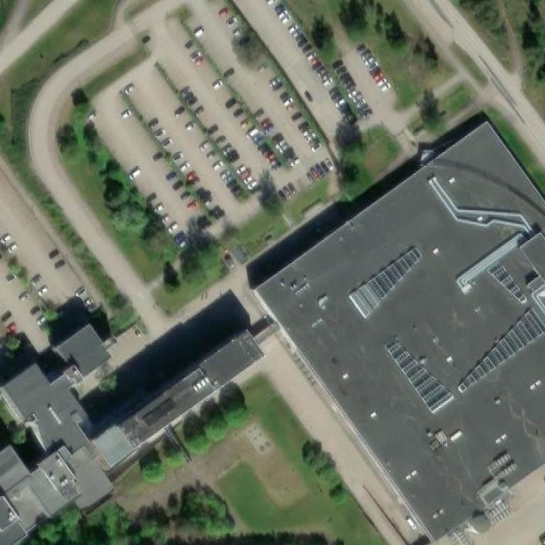
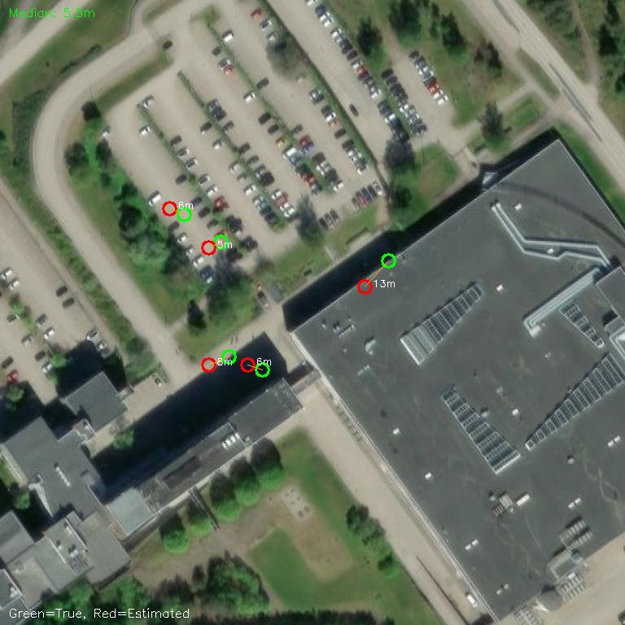
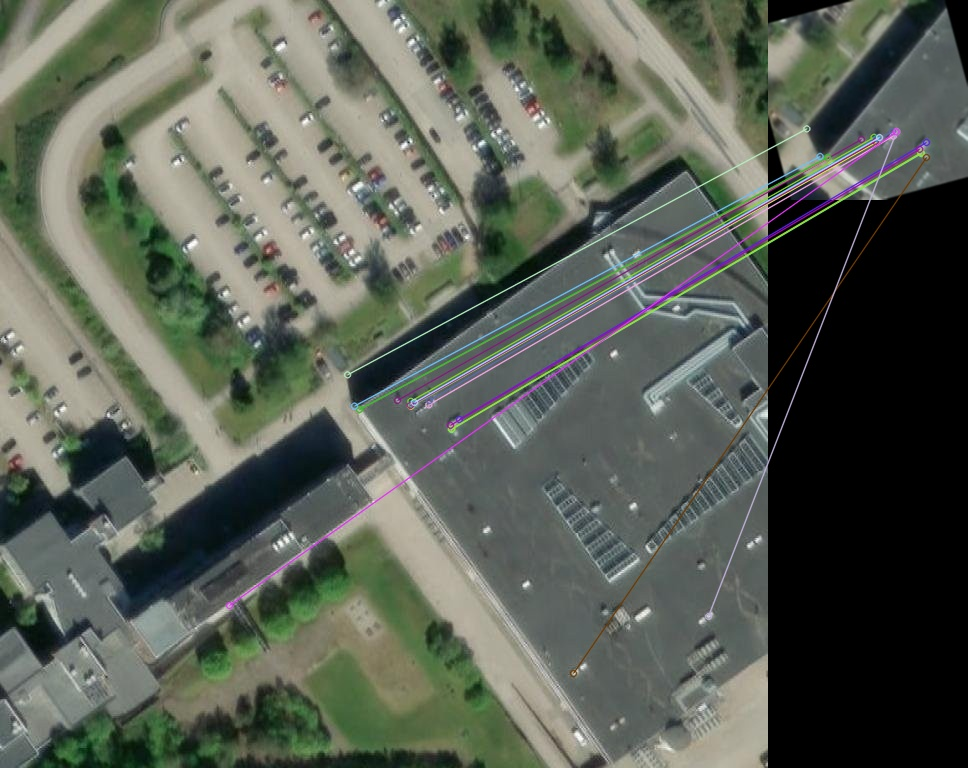

# 5G Drone — Three Independent Use Cases

!!! warning "Scope Clarification"
    These are three **separate** projects sharing the same drone platform.
    **Only UC1 (1:1 Safety Rule) is related to the patent.**
    UC2 (Parking) and UC3 (GNSS-Denied Navigation) are independent research tracks.

| # | Use Case | Patent Relation | Status |
|---|----------|----------------|--------|
| UC1 | **1:1 Safety Rule** — detect person, enforce distance | ✅ **This IS the patent** (WO2025034145A1) | Software ready |
| UC2 | **Parking Occupancy** — vehicle counting from nadir | ❌ Not patent-related | Validated on 3 platforms |
| UC3 | **GNSS-Denied Navigation** — fly without satellites | ❌ Not patent-related — operational capability | Validated (5.8m median) |

> **Supply chain policy:** Avoid Chinese-manufactured electronics where possible. Prefer European, US, Vietnamese, Israeli, or other allied-nation suppliers.

## Why This Matters NOW

GNSS jamming is a daily reality in our region. A drone that can navigate, detect persons, and enforce safety rules **without satellite signals** is not just a patent demo — it's operationally critical. Our computer vision pipeline provides:

- **Position estimation from camera alone** — median 5.8m accuracy (validated)
- **Safety monitoring independent of GPS** — 1:1 rule enforcement works without satellites
- **Complements the 5G positioning team's work** — their network-based positioning + our CV = full redundancy

## Three Use Cases

| # | Use Case | Script | Status |
|---|----------|--------|--------|
| UC1 | **1:1 Safety Rule** — detect person, calculate lateral distance, hold if violated | `mavlink_safety_monitor.py` | ✅ Software ready |
| UC2 | **Parking Occupancy** — vehicle counting from nadir | `parking_monitor.py` | ✅ Validated on 3 platforms |
| UC3 | **GNSS-Denied Navigation** — fly using camera only | `gnss_denied_nav.py` + BlueOS optical flow | ✅ Validated (5.8m median) |

## GNSS-Denied Navigation — Results

### What We Proved (2026-06-15)

We trained a CNN feature extractor on Colab A100 and tested it against our own satellite reference:

| Metric | Result |
|--------|--------|
| **Median position error** | **5.8m** |
| Mean error | 22.1m (pulled up by 3 outliers) |
| Best | 4.1m |
| Under 25m | 70% of tests |
| Model | EfficientNet-B2, 512-d embeddings |
| Training | 30 epochs, triplet loss, 500 hi-res pairs |
| Platform | Colab A100, ~10 min |
| Reference | Jorvas 768×768, ESRI z18, 0.30 m/px |

### How It Works

```
PRE-FLIGHT:
  Download satellite tiles of flight area → embed with CNN → build tile gallery

IN-FLIGHT:
  Downward camera frame → embed with same CNN → match against gallery → get position
  → Send VISION_POSITION_ESTIMATE to ArduPilot EKF3
  → Drone knows where it is WITHOUT GPS

COMBINED SYSTEM:
  Layer 1: BlueOS Optical Flow (real-time velocity, no drift short-term)
  Layer 2: CNN cross-view matching (absolute correction every 5s, median 5.8m)
  Layer 3: IMU (attitude, always available)
  → Expected steady-state accuracy: <5m
```

### Visual Results

#### Satellite Reference (Jorvas, 0.30 m/px, 230m × 230m)


#### CNN Cross-View Matching (EfficientNet-B2, 30 epochs)


*Green = true position, Red = CNN estimated position. Lines show error vector. Median: 5.8m.*

#### ORB Feature Matching Baseline (0.5m on same-resolution)


### Key Insights from Our Iteration

!!! note "Altitude Limitation"
    Cross-view satellite matching provides **horizontal (2D) position only**. It does NOT provide altitude. The drone still needs a barometer or rangefinder for height. This is typically not a problem — barometric altitude is GPS-independent and accurate to ±1m. A downward-facing lidar rangefinder (required anyway for optical flow) gives precise AGL.

1. **Resolution match is critical** — training at 10m/px (EuroSAT/Sentinel-2) completely fails on 0.30m/px reference. Must train at target resolution.
2. **ESRI tiles blocked from Colab** — Google Maps z18 tiles work. Alternative: pre-download tiles locally and upload to Drive.
3. **ORB works perfectly for identical conditions** — 0.5m accuracy when drone altitude matches reference GSD. But breaks with rotation/lighting changes.
4. **CNN adds robustness** — handles ±35° rotation, lighting variation, seasonal differences. Median 5.8m even with heavy augmentation.
5. **Outliers come from ambiguous terrain** — uniform areas (water, fields) confuse the model. Urban/structured terrain works best.
6. **BlueOS optical flow is the foundation** — provides drift-free velocity. CNN provides absolute fix. Together = complete solution.

## UC1: Patent Claims (WO2025034145A1) — 1:1 Safety Rule ONLY

!!! info "Patent Scope"
    The patent covers **only** the 1:1 safety rule: detect a person → calculate lateral distance → compare with altitude → issue alert / hold. Parking occupancy and GNSS-denied navigation are **not** part of the patent.

| Claim | Validation |
|-------|-----------|
| 1: Detect + calculate + compare + issue | Safety monitor on ground server via 5G |
| 4: Focal length from metadata | Gremsy gimbal + camera EXIF/SDK |
| 7: Prevent further approach | GUIDED_LOITER command over 5G |
| 8: Initiated by receiving unit | Ground server triggers the hold |
| 10: External communication device | Ground server over 5G/3GPP |
| 11: Multispectral | FLIR thermal + RGB (Workswell WIRIS alternative) |

## Hardware

| Component | Part | Origin | Status |
|-----------|------|--------|--------|
| Drone | Holybro X650 + Cube Orange+ | 🇺🇸/🇦🇺 | ✅ Flying |
| Companion | RPi CM4 + Ochin Tiny V2 + BlueOS | 🇬🇧/🇺🇸 | 🟡 Next |
| Connectivity | 5G modem + ZeroTier | Non-Chinese | 🟡 Next |
| Camera/Gimbal | Gremsy Pixy U/Mio + IP camera | 🇻🇳 Vietnam | 🔴 To acquire |
| Thermal | FLIR Boson 640 / Workswell WIRIS | 🇺🇸/🇨🇿 | 🔴 Optional |

### Camera Selection

**Gremsy (Vietnam):** MAVLink native gimbal with pitch telemetry. Pair with any IP camera. ~€900–1,500.

**Why not SIYI:** Chinese manufacturer — conflicts with supply chain policy.

## Software Stack

```
src/mavlink_safety/
├── mavlink_safety_monitor.py    ← UC1: 1:1 rule enforcement over 5G
├── mavlink_mqtt_bridge.py       ← Bidirectional MAVLink ↔ MQTT
├── rtsp_metadata_extractor.py   ← Claim 4: focal length from camera
└── gnss_denied_nav.py           ← UC3: visual odometry + CNN matching
```

**Colab notebook:** [gnss_denied_crossview_training.ipynb](https://colab.research.google.com/github/rwiren/drone-cv-detection/blob/main/notebooks/gnss_denied_crossview_training.ipynb)

## Next Steps — What the Team Needs to Do

### Phase 1: BlueOS + 5G (get the drone online)
1. Flash BlueOS on RPi CM4
2. Connect Cube Orange+ via Ethernet
3. Install 5G modem + ZeroTier
4. **Milestone:** Receive live telemetry on ground PC over 5G

### Phase 2: Camera + CV (prove the patent)
5. Mount Gremsy gimbal + camera
6. Run safety monitor over 5G → person detection + hold command
7. **Milestone:** Drone stops when approaching a person (claims 7, 8, 10)

### Phase 3: GNSS-Denied (the differentiator)
8. Enable BlueOS OpticalFlow extension (camera pointing down)
9. Load Jorvas satellite reference + trained CNN model
10. Fly without GPS — confirm stable position hold
11. **Milestone:** Autonomous waypoint mission without GPS, safety monitor still active

### Phase 4: Demo
12. Combined demo: 5G + GNSS-denied + safety monitoring
13. Record video evidence for patent prosecution
14. Present to 5G positioning team for joint architecture

## Architecture

```
DRONE                              5G / INTERNET                    GROUND
─────                              ────────────                    ──────
Cube Orange+                                              mavlink_safety_monitor.py
    ↕ MAVLink                                                    │
RPi CM4 (BlueOS)                                                 │ YOLO + lateral dist
    ├── MAVLink proxy ──── ZeroTier ──── 5G ────────── telemetry │ + CNN cross-view
    ├── Camera RTSP ────── ZeroTier ──── 5G ────────── video     │
    ├── Optical Flow ──→ EKF3 (local)                            │
    └── 5G modem                                                 ▼
                                                    VIOLATED? → GUIDED_LOITER
                                                                 │
                                                    5G ── ZeroTier ── BlueOS ── Cube
                                                         Drone holds position
```

## Resources

- **Models (gitignored, on local disk):** `crossview_effb2_512d_v2.pth` (35MB)
- **Reference tiles:** `data/satellite_tiles/` (Jorvas area)
- **Evaluation results:** `outputs/evaluation/gnss_denied_crossview_results.json`
- **Colab notebook:** public on GitHub for reproducibility
- **BlueOS:** [blueos.cloud](https://blueos.cloud/docs/latest/usage/overview/)
- **ArduPilot non-GPS:** [ardupilot.org/copter/docs/common-non-gps-navigation](https://ardupilot.org/copter/docs/common-non-gps-navigation-landing-page.html)
- **BlueOS OpticalFlow:** [github.com/BlueOS-community/blueos-opticalflow](https://github.com/BlueOS-community/blueos-opticalflow)
