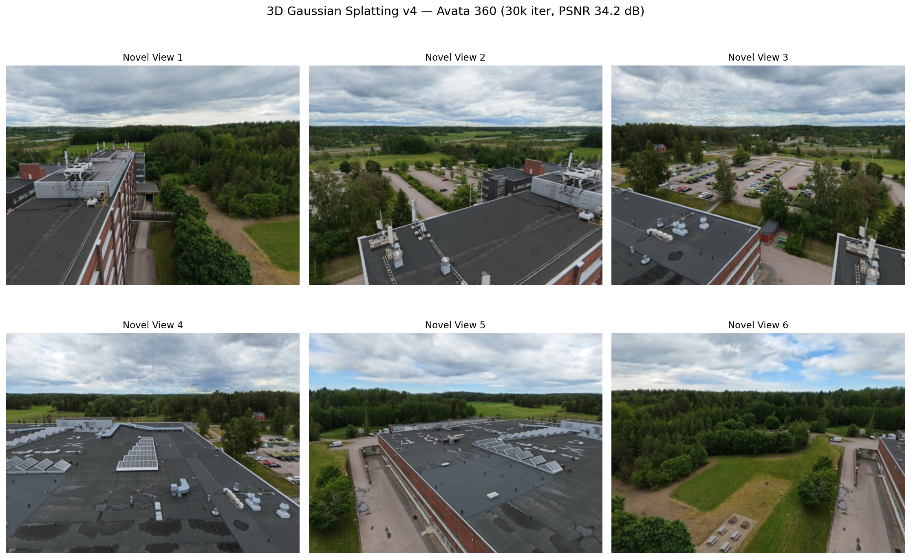
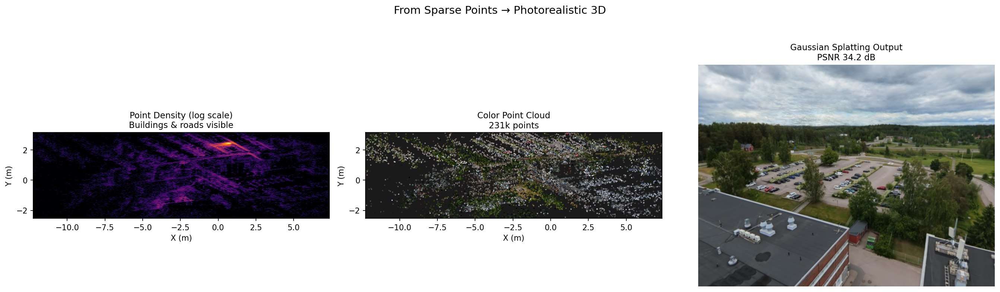

# UC4: 3D Gaussian Splatting

Photorealistic 3D reconstruction from DJI Avata 360 drone footage using Gaussian Splatting.

## Results (v4, 30k iterations)



*Novel views rendered from trained 3DGS model — PSNR 34.2 dB. Sharp edges, correct geometry.*

| Iteration | PSNR | L1 Loss | Model Size |
|-----------|------|---------|------------|
| 7,000 | 28.4 dB | 0.023 | 345 MB |
| 15,000 | 32.4 dB | 0.015 | 443 MB |
| **30,000** | **34.2 dB** | **0.013** | **443 MB** |

## 3D Point Cloud (COLMAP)



*240,076 colored 3D points from 432 registered images. Left: log-scale density heatmap. Center: color cloud. Right: final render.*

## Pipeline

```
DJI Avata 360 (8K equirectangular, 7680×3840)
    │
    ▼ Extract perspective views (36 positions × 6 yaw × 2 pitch)
432 images (1024×768, ground-facing, right-side-up)
    │
    ▼ COLMAP Structure-from-Motion (OPENCV camera model, 33 min)
432/432 registered (100%), 240,076 3D points
    │
    ▼ Undistort (OPENCV → PINHOLE, required by Gaussian Splatting)
432 undistorted images + PINHOLE camera parameters
    │
    ▼ 3D Gaussian Splatting (Colab A100, 30k iterations, 19 min)
Photorealistic 3D model (443 MB, PSNR 34.2 dB)
```

## Lessons Learned (v1→v4)

| Version | Problem | Fix |
|---------|---------|-----|
| v1-v2 | Images sky-facing (pitch inverted) | Corrected pitch sign (+ve = ground) |
| v3 | Images upside-down | Flipped 180° |
| v3 | COLMAP used OPENCV model | GS only supports PINHOLE |
| **v4** | All fixed | **Undistort OPENCV→PINHOLE, correct orientation** |

Key insight: The Gaussian Splatting algorithm is extremely sensitive to correct camera calibration. Even slightly wrong geometry causes blurry, melted renders.

## Applications

- **Site inspection** — photorealistic 3D model from a single 360° fly-over
- **GNSS-denied localization** — localize against the 3D map (centimeter-level)
- **Change detection** — compare splats from different dates
- **Digital twin** — virtual site walkthrough from any angle

## Colab Notebooks

- [v4 (final)](https://colab.research.google.com/github/rwiren/drone-cv-detection/blob/main/notebooks/gaussian_splat_avata360_v4.ipynb) — 30k iter, PINHOLE undistorted
- [v3](https://colab.research.google.com/github/rwiren/drone-cv-detection/blob/main/notebooks/gaussian_splat_avata360_v3.ipynb) — 30k iter (wrong orientation)
- [v2](https://colab.research.google.com/github/rwiren/drone-cv-detection/blob/main/notebooks/gaussian_splat_avata360_v2.ipynb) — first working attempt
