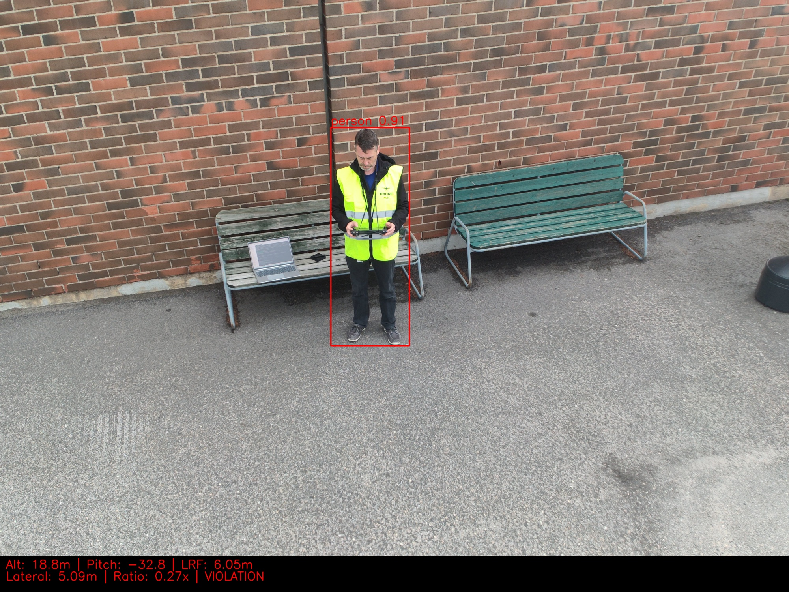
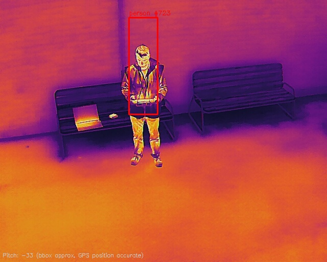

# Autel EVO MAX 4T V2 xe

## Specs
- Wide: 1/1.28" 50MP, 4.5mm (23mm eq.) f/1.9, FOV 85°
- Zoom: 1/2" 48MP, 11.8-43.3mm (64-234mm eq.)
- Thermal: 640×512, 13mm f/1.2, DFOV 42°
- LRF: ±1m accuracy, 1200m range
- Onboard AI: vehicle (cls_id=3), person (cls_id=30), bicycle (cls_id=2)
- Firmware: v1.9.1.219

## Pipeline
- `src/rule_monitor.py` — Real-time 1:1 rule via MQTT
- `src/autel_telemetry.py` — OSD parser + bbox calibration
- `src/flight_map.py` — Interactive Folium map

## Key Findings
- [MQTT FOV Mismatch](../calibration/autel-fov-mismatch.md) — original research
- [Firmware Label Swap](../calibration/firmware-labels.md) — ir/zoom fields swapped
- LRF provides ground-truth for patent validation

| 1:1 Rule Violation (18.8m) | Thermal Person Detection |
|---|---|
|  |  |

