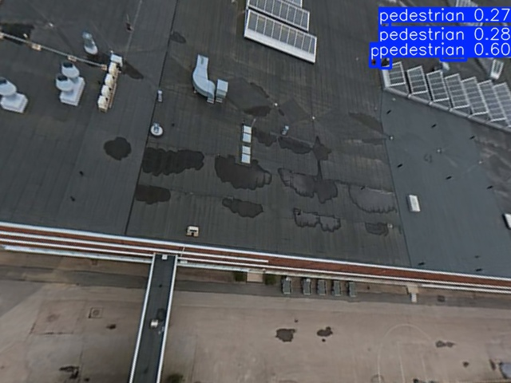
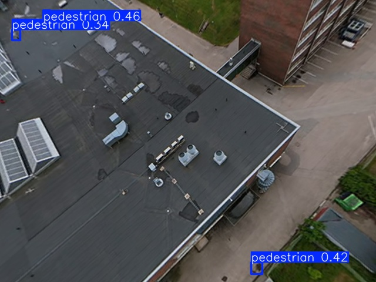
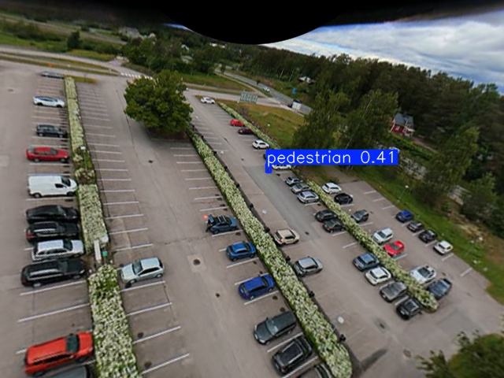
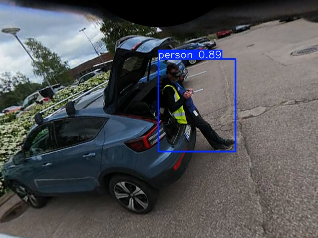

# DJI Avata 360

## Hardware Specs

- **Format:** Dual-fisheye (2× 200° f/1.9 lenses)
- **Layout:** Right lens = nadir (ground), Left lens = zenith (sky)
- **Proxy:** .LRF — 1920×960 (two 960×960 fisheye circles)
- **Full-res:** .OSV — dual-fisheye at higher resolution
- **Telemetry:** SRT sidecar at 60fps (GPS, altitude, yaw, pitch per frame)
- **Stabilization:** RockSteady 3.0 (horizon lock regardless of FPV maneuvers)
- **Coverage:** 360° omnidirectional — no gimbal pointing required

## Pipeline

```
Dual-fisheye frame (1920×960)
        │
        ▼
Split: Right lens (960×960) = nadir
        │
        ▼
Equidistant fisheye projection (r = f·θ)
        │
        ▼
8 perspective views (640×480, every 45°)
        │
        ▼
YOLO ensemble: v8m (aerial) + COCO (close)
        │
        ▼
Best detection per view → report azimuth + confidence
```

## Detection Results (Descent Sequence)

| 8.4m | 4.4m | 2.9m | 2.2m |
|------|------|------|------|
|  |  |  |  |

| Altitude | VisDrone v8m | COCO yolov8s | Ensemble |
|----------|-------------|-------------|----------|
| 8.4m | **0.60** | 0.36 | 0.60 |
| 4.4m | **0.46** | 0.33 | 0.46 |
| 2.9m | **0.41** | miss | 0.41 |
| 2.2m | 0.50 | **0.89** | 0.89 |

## Parking Detection from Avata

The nadir view (pitch=0) captures vehicles from directly below:

| Timestamp | Altitude | Vehicles Detected |
|-----------|----------|-------------------|
| t=10s | 21.0m | 38 |
| t=30s | 48.2m | 46 |
| t=180s | 2.3m | 24 |

## Key Finding: Dual-Fisheye, Not Equirectangular


The DJI Avata 360 .LRF files are **not** equirectangular panoramas. They contain raw dual-fisheye (two circular images). The correct projection is:

```python
# Equidistant fisheye: r = f_fish * theta
theta = np.arccos(np.clip(z, -1, 1))
phi = np.arctan2(y, x)
r = f_fish * theta
src_x = cx + r * np.cos(phi)
src_y = cy + r * np.sin(phi)
```

This was the root cause of broken detection in early versions — using equirectangular (lon/lat) mapping produced rotated garbage output.
