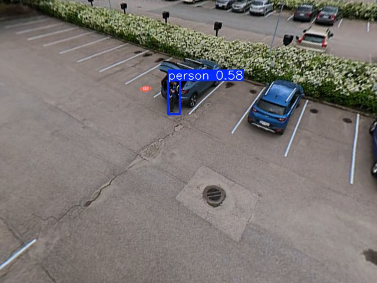
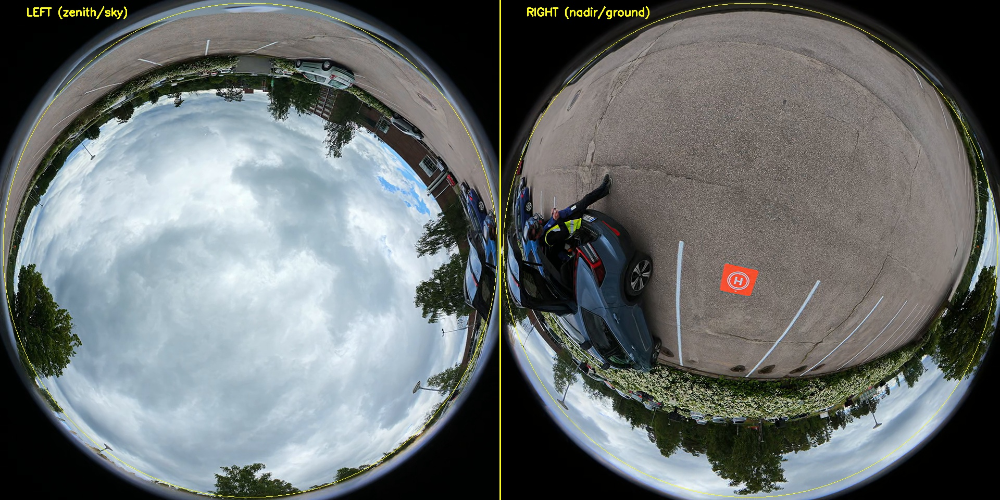

# DJI Avata 360

## Hardware Specs

- **Format:** Dual-fisheye (2× 200° f/1.9 lenses)
- **Layout:** Right lens = nadir (ground), Left lens = zenith (sky)
- **Proxy:** .LRF — 1920×960 (two 960×960 fisheye circles)
- **Full-res:** .OSV — dual-fisheye at higher resolution
- **Telemetry:** SRT sidecar at 60fps (GPS, altitude, yaw, pitch per frame)
- **Stabilization:** RockSteady 3.0 (horizon lock regardless of FPV maneuvers)
- **Coverage:** 360° omnidirectional — no gimbal pointing required

## Pipeline

```
Dual-fisheye frame (1920×960)
        │
        ▼
Split: Right lens (960×960) = nadir
        │
        ▼
Equidistant fisheye projection (r = f·θ)
        │
        ▼
8 perspective views (640×480, every 45°)
        │
        ▼
YOLO ensemble: v8m (aerial) + COCO (close)
        │
        ▼
Best detection per view → report azimuth + confidence
```

## Detection Results

| Parking lot (~7m) | Close-up (~2m) |
|---|---|
|  |  |
| Person at **0.63** conf (combined model) | Person at **0.90** conf (COCO) |

The combined model (VisDrone + Avata crops) gives +0.27 conf improvement on domain-specific Avata frames compared to VisDrone-only v8m.

## Parking Detection from Avata

The nadir view (pitch=0) captures vehicles from directly below:

| Timestamp | Altitude | Vehicles Detected |
|-----------|----------|-------------------|
| t=10s | 21.0m | 38 |
| t=30s | 48.2m | 46 |
| t=180s | 2.3m | 24 |

## Key Finding: Dual-Fisheye, Not Equirectangular



The DJI Avata 360 .LRF files are **not** equirectangular panoramas. They contain raw dual-fisheye (two circular images). The correct projection is:

```python
# Equidistant fisheye: r = f_fish * theta
theta = np.arccos(np.clip(z, -1, 1))
phi = np.arctan2(y, x)
r = f_fish * theta
src_x = cx + r * np.cos(phi)
src_y = cy + r * np.sin(phi)
```

This was the root cause of broken detection in early versions — using equirectangular (lon/lat) mapping produced rotated garbage output.

## File Formats (Documented)

| File | Resolution | Content | Usable for CV |
|------|-----------|---------|---------------|
| `.LRF` | 1920×960 | Both lenses side-by-side (left=zenith, right=nadir) | ✅ Best for detection |
| `.OSV` | 3840×3840 | Single lens only (zenith/sky) at full resolution | ❌ Sky only, no ground |
| `.MP4` (DJI export) | 7680×3840 | Stitched equirectangular (both lenses) | 🔜 To be tested |

**Finding:** The raw .OSV file contains only the upward-facing (zenith) lens at native sensor resolution. The nadir (ground) lens is NOT in this file. To get both lenses at full resolution, the DJI Fly app or DJI Studio must stitch them into an equirectangular 8K MP4.

**Implication:** For CV detection, the LRF proxy (1920×960) remains the best direct source. Full-resolution 360° requires DJI Studio export → equirectangular MP4, which then needs a different extraction approach (lon/lat mapping instead of fisheye projection).
