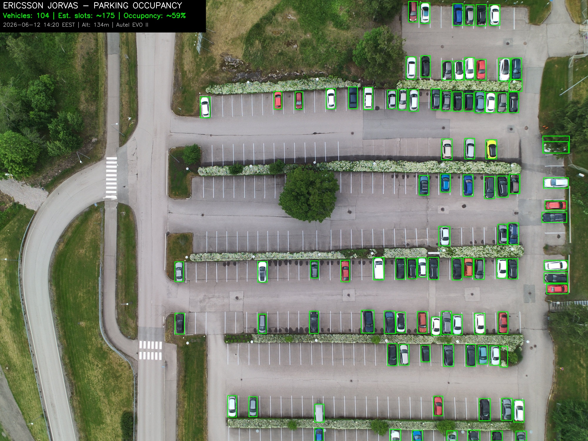
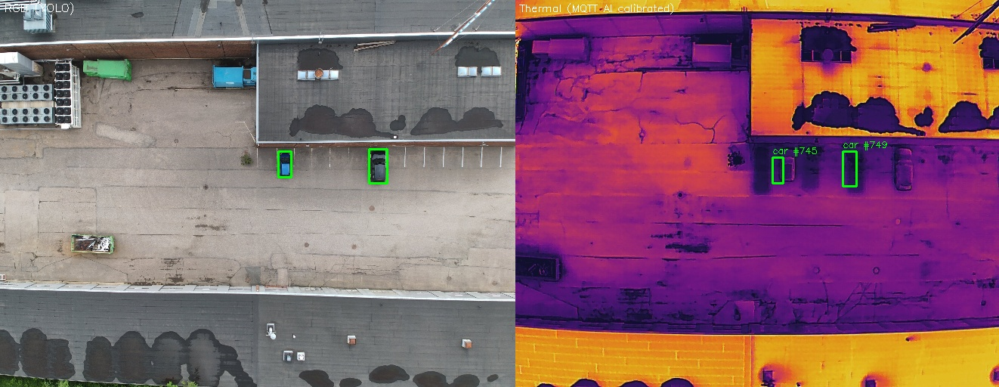
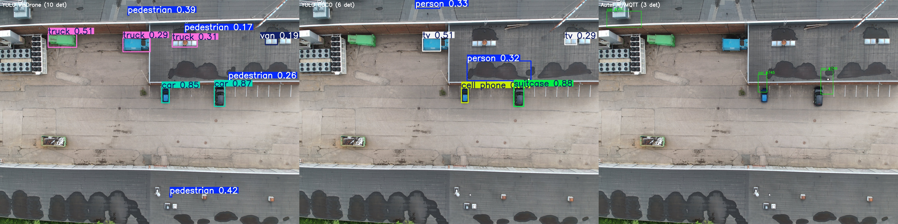
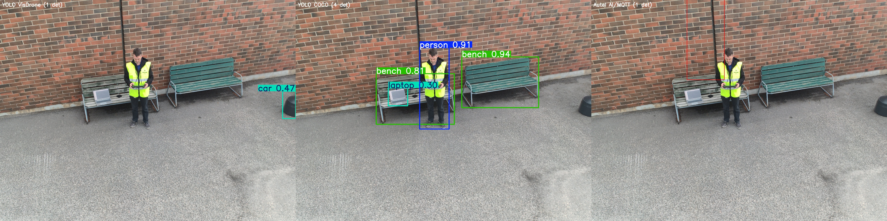

# Sample Detections

## DJI M2EA — Vehicle Detection & Tracking

| Detection (VisDrone) | Tracking (ByteTrack) | 1:1 Safety Rule |
|---|---|---|
|  |  |  |

| Segmentation OBB | Parking Occupancy | Thermal Overlay |
|---|---|---|
|  |  |  |

---

## Autel MAX 4T V2 xe — Parking & Person Detection (2026-06-12)

| Parking Wide | Parking Close | VisDrone 1280 |
|---|---|---|
|  |  |  |

| 1:1 Rule (Close) | 1:1 Rule (Far) |
|---|---|
|  |  |

| Thermal Person | Thermal Parking (MQTT overlay) |
|---|---|
|  |  |

| Model Comparison (Parking) | Model Comparison (Person) |
|---|---|
|  |  |

---

## DJI Avata 360 — 360° Person Detection (2026-06-12)

| Dual-Fisheye Raw | Perspective Extracted |
|---|---|
|  |  |

| Parking Detection | Close-Range (2m) |
|---|---|
|  |  |

---

## Detection Performance by Altitude

| Altitude | Model | Confidence | Platform |
|----------|-------|-----------|----------|
| 2m | COCO yolov8s | 0.89–0.90 | Avata 360 |
| 5.7m | VisDrone v8m 1280 | 0.56 | Avata 360 |
| 8m | VisDrone v8m 1280 | 0.60 | Avata 360 |
| 32m | VisDrone v8m 1280 | 0.31 | Avata 360 (8K) |
| 70m | VisDrone v8s 1280 | 0.86 | M2EA |
