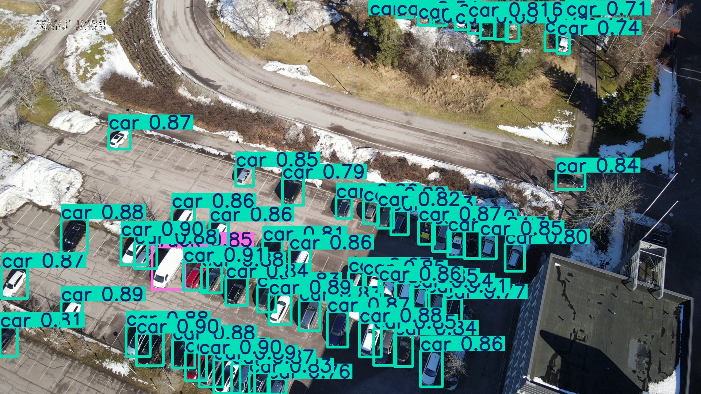
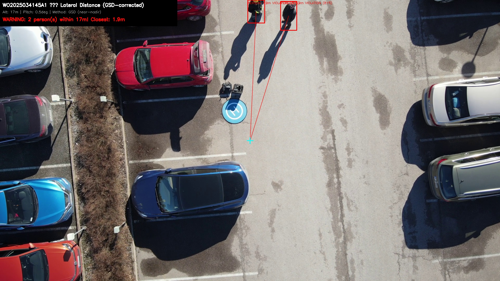
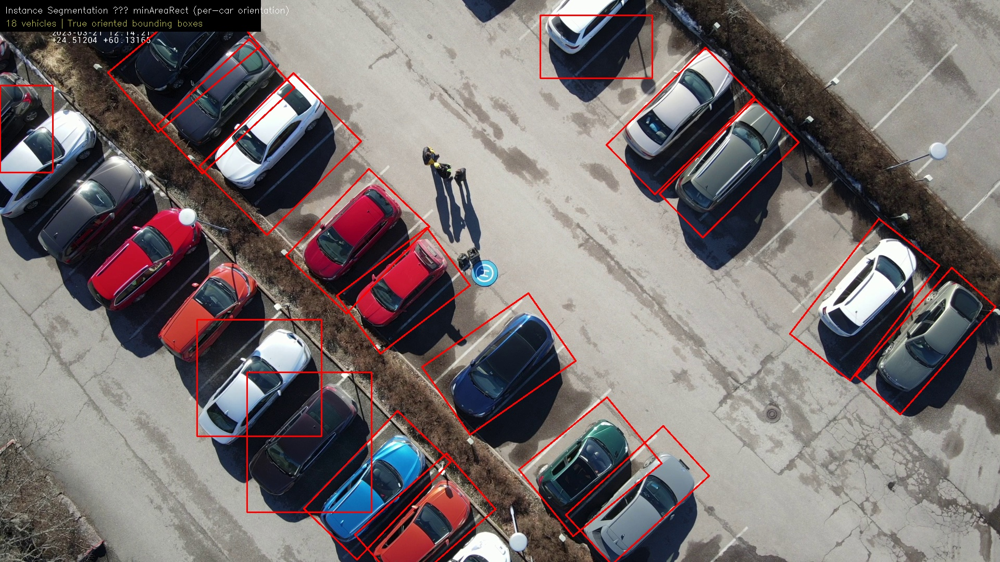

# Sample Detections

## DJI M2EA — Vehicle Detection & Tracking

| Detection (VisDrone) | Tracking (ByteTrack) | 1:1 Safety Rule |
|---|---|---|
|  |  |  |

| Segmentation OBB | Parking Occupancy | Thermal Overlay |
|---|---|---|
|  |  |  |

## Detection Performance by Altitude

| Altitude | Model | Confidence | Notes |
|----------|-------|-----------|-------|
| 2m | COCO yolov8s | 0.89 | Close-range, person fills frame |
| 5.7m | VisDrone v8m 1280 | 0.56 | Aerial, small target |
| 8m | VisDrone v8m 1280 | 0.60 | Aerial, reliable |
| 32m | VisDrone v8m 1280 | 0.31 | High altitude, 8K pipeline |
| 70m | VisDrone v8s 1280 | 0.86 | M2EA high-altitude test |
