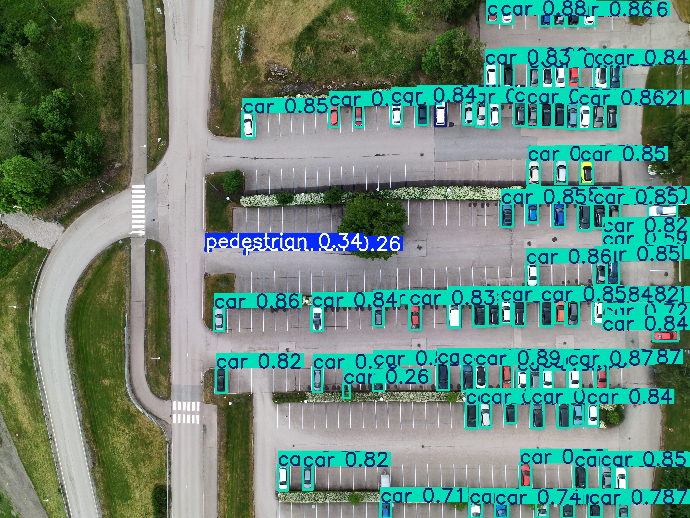

# Parking Occupancy Monitoring

Aerial vehicle detection and counting from drone imagery using YOLOv8 fine-tuned on VisDrone.

## Capabilities

- Detect cars, vans, trucks, buses from nadir aerial view
- Count occupied slots and estimate occupancy percentage
- Thermal + RGB fusion for cross-validation
- Aspect ratio filtering to reject false positives (dumpsters, rooftop equipment)
- Works at 50-134m altitude without SAHI (at imgsz=1280)

## Results



*Autel 4K frame (4000×3000) processed natively with VisDrone v8s at imgsz=1280 — 95 cars detected without SAHI.*

| Platform | Altitude | Vehicles | Method |
|----------|----------|----------|--------|
| DJI M2EA | 70m | 55 cars, 5 peds, 2 trucks | VisDrone v8s 1280 native |
| Autel MAX 4T | 80m | 95 cars, 3 vans, 2 persons | VisDrone v8s 1280 on 4K |
| Autel MAX 4T | 134m | 104 vehicles | VisDrone + SAHI |
| Autel MAX 4T | 80m (thermal) | 43 cars, 29 vans | Thermal stream |

## Model Selection

- **VisDrone v8s at imgsz=1280** — recommended for parking (v8m too conservative at conf=0.25)
- At >100m altitude, use SAHI slicing (640×640 tiles with 20% overlap)
- Aspect ratio filter: reject detections where `width/height > 1.4` from nadir

## False Positive Handling

| Source | RGB | Thermal | Solution |
|--------|-----|---------|----------|
| Dumpsters | Green container, landscape aspect | Variable temp | Aspect ratio filter |
| Rooftop HVAC | Rectangular, landscape | Warm/hot | Aspect ratio filter |
| Pavement shadows | Dark area | Cool patch ≈ cold car | RGB cross-check |
| Solar-heated pavement | Normal | Bright (mimics warm car) | RGB cross-check |

## Usage

```bash
# Single frame parking analysis
python src/parking_monitor.py --rgb DJI_0398_W.MP4 --thermal DJI_0399_T.MP4 --frame 1792

# Vehicle detection on any image
python src/detect.py --input parking_aerial.jpg --model models/visdrone_yolov8s_1280_best.pt

# High-res with SAHI slicing (for >100m altitude / 4K+ images)
python -c "
from sahi import AutoDetectionModel
from sahi.predict import get_sliced_prediction
model = AutoDetectionModel.from_pretrained(model_type='yolov8',
    model_path='models/visdrone_yolov8s_1280_best.pt', confidence_threshold=0.2)
result = get_sliced_prediction('image_4000x3000.jpg', model,
    slice_height=640, slice_width=640, overlap_height_ratio=0.2, overlap_width_ratio=0.2)
"
```
